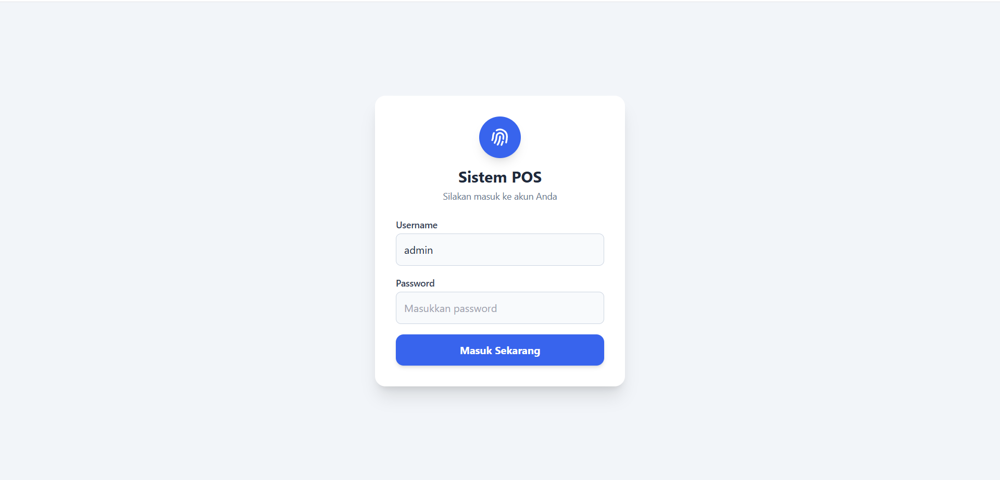
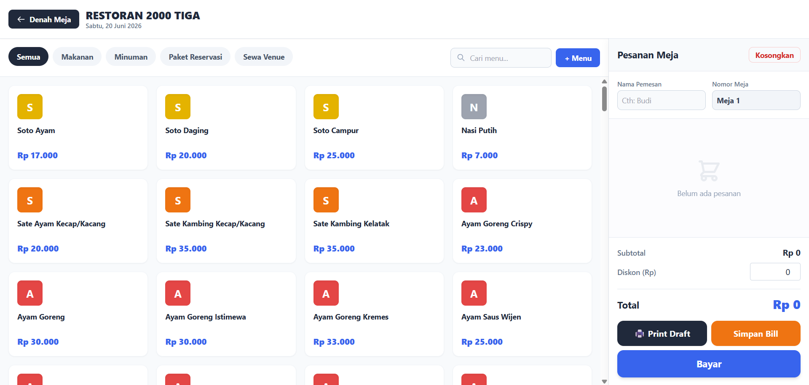
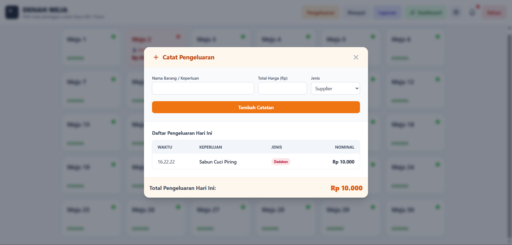
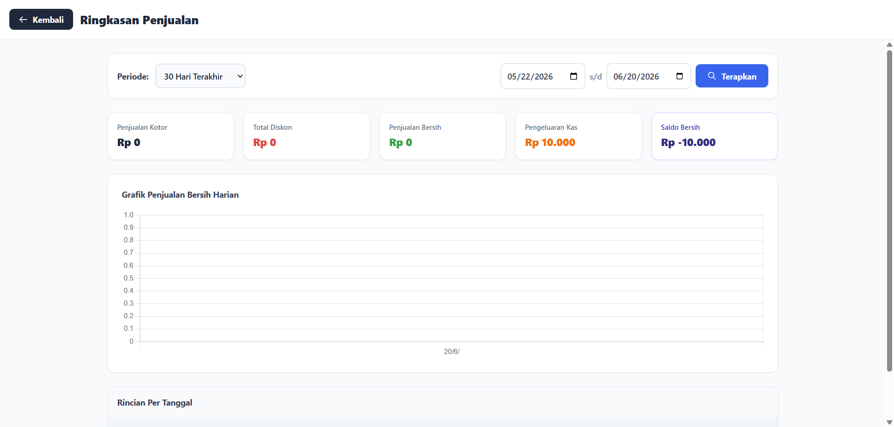

<h1 align="center">🍽️ Restoran 2000 Tiga — POS & QR Self-Ordering Ecosystem</h1>

  <b>An End-to-End F&B Operational Web Application Case Study: Connecting Guest QR Portal to Cashier Engine</b>

  
  
  

---

## 📋 Table of Contents
- [Project Overview](#-project-overview)
- [System Walkthrough](#-system-walkthrough)
  - [Part 1: Cashier Engine (Desktop)](#part-1-cashier-engine-desktop)
  - [Part 2: Guest Self-Ordering (Mobile)](#part-2-guest-self-ordering-mobile)
  - [Part 3: The Real-Time Handshake](#part-3-the-real-time-handshake)
- [Architectural Impact](#-architectural-impact)

---

## 💡 Project Overview

A full-cycle F&B operational utility designed to eliminate dine-in ordering friction for a 30-table restaurant. It bridges the gap between **Customer Self-Ordering via Smartphone** and **Staff Checkout Efficiency** in real-time.

### The Operational Handshake
* **For Guests:** Scan QR $\rightarrow$ Order & Customize $\rightarrow$ Choose Payment (Zero app download required).
* **For Staff:** Get Push Alert $\rightarrow$ Click Accept $\rightarrow$ Auto-fill POS running bill (Zero manual re-typing required).

---

## 🖥️ System Walkthrough

### PART 1: CASHIER ENGINE & BACK-OFFICE (Desktop View)
*Directory: `/kasir-pos` | Designed for speed: zero typing required for standard orders.*

#### 1. Gate Control & Floor Overview
| Shift Login | 30-Table Overview (Vacant) | POS Main Catalog View |
| :---: | :---: | :---: |
|  |  |  |

#### 2. Core POS & Menu Management
| Active Table Cart | Add New Menu Modal | Order Settlement Modal |
| :---: | :---: | :---: |
|  |  |  |

#### 3. Payment, Petty Cash & Auditing
| Payment Success Prompt | Petty Cash Logger | Transaction Logs |
| :---: | :---: | :---: |
|  |  |  |

#### 4. Authorization & Security (Void System)
| Master Password Request | Void Success Confirmation | Notification Center |
| :---: | :---: | :---: |
|  |  |  |

#### 5. Executive Analytics & Hardware Settings
| Daily Cash Settlement | Sales Dashboard & Chart | USB Printer Detection |
| :---: | :---: | :---: |
|  |  |  |

---

### PART 2: GUEST SELF-ORDERING PORTAL (Mobile View)
*Directory: `/mobile-qr` | Optimized for thumb-reach navigation and zero-friction adoption.*

| Mobile Catalog | Modifier & Notes | Table & Identity Form | Order Hand-off | Dispatched Validation |
| :---: | :---: | :---: | :---: | :---: |
|  |  |  |  |  |

---

### PART 3: THE REAL-TIME HANDSHAKE (Loop Closure)
*Demonstrating the live data synchronization from Guest's phone directly to Cashier's desktop.*

1. **The Instant Capture:** The guest hits 'Place Order' on their phone. Instantly, a live floating card triggers on the cashier's dashboard. Staff clicks **`Terima & Masukkan Meja`**.  
   

2. **The Server Handshake:** The system returns a success validation to the cashier.  
   

3. **The Live Floor Update:** The designated table automatically shifts to **Red** on the floor map, instantly generating an accurate active running bill.  
   

4. **The Zero-Typing Checkout:** When the guest walks up to the counter to settle the bill, their order summary is already fully populated. Staff proceeds directly to payment.  
   

---

## 🎯 Architectural Impact

* **100% Bill Integrity:** Mitigated revenue leakage caused by untracked extra orders requested by guests mid-meal.
* **Sub-15 Minute Staff Onboarding:** Linear UI layout allows newly hired cashiers to fully master the checkout workflow with virtually zero training.
* **2-Step Flow:** Reduced standard dine-in ordering bureaucracy from a 5-step analog process to a seamless 2-step digital handshake.
